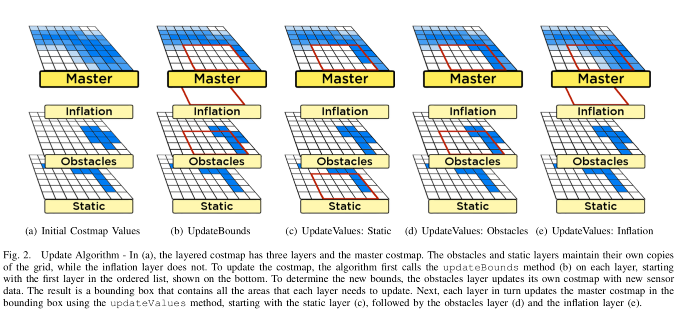

# Autonomous RaceCar -- Client Side Setup

Although Nvidia TX1 has better processing capabilities compared to Nvidia TK1, Raspberry Pi, etc, it still not capable for real time path planning. Therefore, a PC server is needed to handle the task. 

As mentioned in the main overview guide, ROS Master is hanging up in the PC Server side. Remember before running anything on the RaceCar Client Side, ```roscore``` must be running at the PC Server side first.

Before reading this guide, make sure you have read and implement all the setup list in the ***Autonomous RaceCar -- Client Side Setup.md***. 


Since ```sensor transforms``` ,```odometry source```, and ```sensor sources``` have been covered in the Client Side Setup Guide. This guide will focus on the setting up of ```move_base```, the main package of ROS Navigation Stack. But before this, we have to set up the ```map_server``` and ```amcl``` nodes first.


## Load the Built Map to the Navigation Stack

We build the map by running the ```Gmapping``` and saved in with ```map_server``` . The map is a probability based 2D costmap. RaceCar will be using it to understand the surrounding floor plan as to plan the global path. Therefore, ```map_server``` node has to pass the map in a form of ```nav_msgs/GetMap``` with a topic named ```/map``` to the ```costmap_2d``` node. The ```costmap_2d ``` will then generate 2 costmap, a global and local costmaps which is used for global and local path planning. 


To load the map from map_server to costmap_2d by the following command:

```html
<node name="map_server" pkg="map_server" type="map_server" args="$(find racecar_navigation)/maps/ROOM_2.yaml" />
```

## Costmap Setup

As mentioned above, we load a pre-built map with the aid of ```map_server``` , then it converts to two costmaps; global and local costmaps, which used by global and local planner repectively.  Since two costmaps are having different purpose, we have to configure some common and uncommon parameters of two costmaps as to suit our case.

Before tuning and configuring the parameters of two costmaps, there are some fundamental knowledge that have to be clarified. 

2D costmap is represented as a collection of small grid boxes, while each grid box holds a cost value. The costmap uses sensor data and information from the static map(```map_server```) to store and update information about obstacles in the world. The more near the obstacles or wall, the higher cost it will be. Global and Local Planner will be using these costs to plan a zero-collision path. 

Since ROS Indigo, ```costmap_2d``` adopts the ***Multi-Layered Costmap Algorithm*** , which means

> As of the Hydro release, the underlying methods used to write data to the costmap is fully configurable. Each bit of functionality exists in a layer. For instance, the static map is one layer, and the obstacles are another layer.

- Separating the processing of costmap data into separated layers
- Each layer tracks one specific type of obstacle 
- Each layer will modifies the top Master Costmap, which I used for the path planning



###Details about some Fundamental layers

- Static Map Layer

- - Used for Global Planning

  - Generated by SLAM Algorithm

  - With using the Laser Sensor data, knowing where the walls and other static obstacles are

  - When static map layer receives the map from map_server

  - - Return a bounding box covering the entire map 

    - - The bounding box will not increase in size as it is static

  - In Practice,

  - - Static Map Layer is the bottom layer for the Global Costmap
    - It directly copies the cost values to the master costmap

- Obstacles Layers

- - Lidar and/or RGB-D collects data and places it in a 2D grid map

  - Space between the sensor at its reading --> Marked as Free Space

  - Sensor Reading's Location --> Marked Occupied

  - During the updateBound,

  - - New sensor data is placed into the layer's costmap,

    - - Bounding box expands to fit it

  - Finally, Obstacle Layers will add the lethal obstacles to the master costmap

- Voxels Layers

- - Same function as the Obstacle Layers

  - BUT !!! 

  - - It tracks sensor data in 3D

  - It can reflect multiple heights of the walls or obstacles

- Inflation Layers

- - Inflation Process

  - - Inserts a buffer zone around each lethal obstacles

    - Small non-lethal costs are added on the surround areas

    - - Make sure the robot does not get too close or collide with the obstacles

  - updateBound step will increase the previous bounding box !!! 

  - updateValues operates directly on the master costmap

### Costmaps Configure

ROS wiki: http://wiki.ros.org/navigation/Tutorials/RobotSetup
​          	 http://wiki.ros.org/costmap_2d/Tutorials

So generally, we have two costmaps that each of one has several layers. We have to configure the layers and some parameters of two costmaps. The parameters and configuration are stored at ```PC_Server/catkin_ws/src/racecar_navigation/params/carlike```. 

There are 3 related configuration files ```.yaml``` : 

- [costmap_common_params.yaml](https://github.com/Tiga002/Autonomous_RaceCar/blob/master/PC_Server/catkin_ws/src/racecar_navigation/params/carlike/costmap_common_params.yaml)
  - Stores the common parameters of both costmaps
- [global_costmap_params.yaml](https://github.com/Tiga002/Autonomous_RaceCar/blob/master/PC_Server/catkin_ws/src/racecar_navigation/params/carlike/global_costmap_params.yaml) 
  - Stores the parameters of global costmap
- [local_costmap_params.yaml](https://github.com/Tiga002/Autonomous_RaceCar/blob/master/PC_Server/catkin_ws/src/racecar_navigation/params/carlike/local_costmap_params.yaml)
  - Stores the parameters of local costmap

***```costmap_2d ```node and the costmap parameters will be launched whenever move_base is told to launch***

#### Common Costmap Parameters

```yaml
footprint: [[-0.2, -0.1], [-0.2, 0.1], [0.2, 0.1], [0.2, -0.1]] # define the robot shapes
footprint_padding: 0.01
transform_tolerance: 0.2
map_type: costmap
# Define different layers
obstacle_layer:
 enabled: true
 obstacle_range: 3.0
 raytrace_range: 3.5
 inflation_radius: 0.1
 track_unknown_space: false
 combination_method: 1
 observation_sources: laser_scan_sensor
 laser_scan_sensor: {data_type: LaserScan, topic: scan, marking: true, clearing: true}

inflation_layer:
  enabled:              true
  cost_scaling_factor:  10.0  
  inflation_radius:     0.1   

static_layer:
  enabled:              true
  map_topic:            "/map"
```

#### Global Costmap Parameters

```yaml
global_costmap:
  global_frame: /map
  robot_base_frame: base_link
  update_frequency: 5.0
  publish_frequency: 2.0
  static_map: true
 
  transform_tolerance: 0.5
  # Using plugins method to setup the multi-layered costmap
  plugins:
    - {name: static_layer,            type: "costmap_2d::StaticLayer"}
    - {name: obstacle_layer,          type: "costmap_2d::VoxelLayer"}
    - {name: inflation_layer,         type: "costmap_2d::InflationLayer"}
```

#### Local Costmap Parameters

```yaml
local_costmap:
  global_frame: /map
  robot_base_frame: base_link
  update_frequency: 5.0
  publish_frequency: 2.0
  static_map: false
  rolling_window: true
  width: 4.0
  height: 4.0
  resolution: 0.1
  transform_tolerance: 0.5
  # Using plugins method to setup the multi-layered costmap
  plugins:
   - {name: static_layer,        type: "costmap_2d::StaticLayer"}
   - {name: obstacle_layer,      type: "costmap_2d::ObstacleLayer"}
```

## Estimate Current Position within a Known map

The essential thing for indoor navigation is to know where the robot is located at within a known map simultaneously. Monte Carlo Localization and Particle Filter is used to locate robot. For more theory side, please review the book ***Probabilistic Robotics*** . To implement this theory, we have to use the ```amcl``` package.

Official ROS wiki: http://wiki.ros.org/amcl

```amcl``` subscribe the Lidar Scan ```sensor_msg/LaserScan``` from the ```rplidar``` node, as well as the ```/map``` topic published by ```map_server```.  Particle Filter is adapted to predict the current position. Then it publishes the current position prediction with a topic named ```amcl_pose``` . 

There are loads of parameters can be tuned and configured by user. User can tune those parameters within the launch file of ```amcl``` node. The path of the launch file is located at: 

```PC_Server/catkin_ws/src/racecar_navigation/launch/RaceCar_AMCL.launch```

**Launching AMCL**

```bash
<include file="$(find racecar_navigation)/launch/RaceCar_AMCL.launch" />
```

## Move_base Setup

ROS wiki: http://wiki.ros.org/move_base?distro=kinetic

Til now, we have been finished setting up the surrounding environment for the main package ```move_base```.

> The move_base node links together a global and local planner to accomplish its global navigation task. It supports any global planner adhering to the nav_core::BaseGlobalPlanner interface specified in the [nav_core](http://www.ros.org/wiki/nav_core) package and any local planner adhering to the nav_core::BaseLocalPlanner interface specified in the [nav_core](http://www.ros.org/wiki/nav_core)package. The move_base node also maintains two costmaps, one for the global planner, and one for a local planner (see the [costmap_2d](http://www.ros.org/wiki/costmap_2d) package) that are used to accomplish navigation tasks. 

### ROS Package:: NAV_CORE

- Provides the key interfaces for the ROS Navigation Stack.
- Currently, it is providing interface for
  - BaseGlobalPlanner
  - BaseLocalPlanner
  - RecoveryBehaviour
- These Nodes are written as plugins for the move_base node
  - They must adhere to the nav_core interface in order to be used in the move_base node

#### BaseGlobalPlanner

- ```nav_core::BaseGlobalPlanner ```

- - Provides interface for Global Planner

- All Global Planner written as a plugin for the move_base must adhere with this interface

- Currently, most popular Global Planner using this interface have:

- - ```Global_Planner```

  - - pluginlib name: ```global_planner/GlobalPlanner```

  - ```Navfn```

  - - pluginlib name: ```navfn/NavfnROS```
    - **We are using this Local Planner in RaceCar Project**

  - ```Carrot_planner```

  - - pluginlib name: ```carrot_planner/CarrotPlanner```

#### BaseLocalPlanner

- ```nav_core::BaseLocalPlanner``` 

- - Provides interface for Local Planer

- All Local Planner written as a plugin for the move_base must adhere with this interface

- Currently, most popular Local Planner using this interface have:

- - ```Base_local_planner```

  - ```Dwa_local_planner```

  - - pluginlib name: ```dwa_local_planner/DWAPlannerROS```

  - ```Teb_local_planner```

  - - pluginlib name: ```teb_local_planner/TebLocalPlannerROS```
    - **We are using this Local Planner in RaceCar Project**

### Move_base Configuration

ROS wiki : http://wiki.ros.org/move_base?distro=kinetic

Good Guide : 

We have to choose which BaseGlobalPlanner and BaseLocalPlanner to be used, and setting up some planner and controller parameters. I put these configuration in the configuration file [move_base_params.yaml](https://github.com/Tiga002/Autonomous_RaceCar/blob/master/PC_Server/catkin_ws/src/racecar_navigation/params/move_base_params.yaml) .

```yaml
# Choose which Global Planner Plugin to use
base_global_planner: navfn/NavfnROS
# Choose which Local Planner Plugin to use
base_local_planner: teb_local_planner/TebLocalPlannerROS
# Output /cmd_vel at this rate
controller_frequency: 2.0
controller_patience: 15.0

planner_frequency: 1.0
planner_patience: 5.0

oscillation_timeout: 60.0
oscillation_distance: 0.05

shutdown_costmap: false
recovery_behavior_enabled: false
conservative_reset_dist: 0.1
# Ackernmann steerling robot cannot rotate, that's why set to false
clearing_rotation_allowed: false
```

After that, we have to configure the Global Planner. The configuration is put at [base_global_planner_params.yaml](https://github.com/Tiga002/Autonomous_RaceCar/blob/master/PC_Server/catkin_ws/src/racecar_navigation/params/base_global_planner_params.yaml).

```yaml
NavfnROS:
    # Navfn is used for global path planning
    allow_unknown: true
    planner_window_x: 0.0
    planner_window_y: 0.0
    default_tolerance: 0.0
    visualize_potential: false
```

Global Planner plans a most optimize path from the starting point to the goal point. It neglects the non-static obstacle or sudden change of environment, also dynamics of the robot is also un-accounted. Therefore, we cannot make use the global path as a reference trajectory directly. A Local Planner is needed to generate a path that is a smaller section of the global path, where sudden change of environment and dynamics of the robot is accounted. 

In RaceCar Project, Timed-Elastic-Band Local Planner is used. For more information please visit:
ROS official wiki: http://wiki.ros.org/teb_local_planner 

Since dynamics of the robot is accounted for the TEB Local Planner, every robot has different dynamics characteristics, we have to configure the RaceCar dyanmics setting. All the parameters and configurations on TEB Local Planner is put at [teb_local_planner_params.yaml](https://github.com/Tiga002/Autonomous_RaceCar/blob/master/PC_Server/catkin_ws/src/racecar_navigation/params/teb_local_planner_params.yaml). 

There are many parameters that we can tune and configure. I have snapped the vital section from the long configuration file.

Here we configre the physical characteristic of the RaceCar, such as the maximum velocity, acceleration, size of the RaceCar.
For setting up the footprint, you may reference to the official tutorial:
http://wiki.ros.org/teb_local_planner/Tutorials

```yaml
  # Robot
 max_vel_x: 4.0
 max_vel_x_backwards: 1.0
 max_vel_y: 0.0
 max_vel_theta: 0.3 
 acc_lim_x: 3.0
 acc_lim_theta: 0.5
 # ********************** Carlike robot parameters ********************
 min_turning_radius: 0.5        # Min turning radius of the carlike robot (compute value using a model or adjust with rqt_reconfigure manually)
 wheelbase: 0.35                 # Wheelbase of our robot
 cmd_angle_instead_rotvel: True # stage simulator takes the angle instead of the rotvel as input (twist message)
 # ********************************************************************
 footprint_model: # types: "point", "circular", "two_circles", "line", "polygon"
   type: "line"
   line_start: [0.0, 0.0] # for type "line"
   line_end: [0.3, 0.0] # for type "line"
```

Here we configure the tolerance of the goal point as well as the minimum distance between the RaceCar and obstacles. 

```yaml
 # GoalTolerance
 xy_goal_tolerance: 0.3
 yaw_goal_tolerance: 0.5
 free_goal_vel: False
 # Obstacles
 min_obstacle_dist: 0.2 # This value must also include our robot's expansion, since footprint_model is set to "line".
 include_costmap_obstacles: True
 costmap_obstacles_behind_robot_dist: 1.0
 obstacle_poses_affected: 30
 costmap_converter_plugin: ""
 costmap_converter_spin_thread: True
 costmap_converter_rate: 5
```


## Base Controller 

[PID_Base_Controller.py](https://github.com/Tiga002/Autonomous_RaceCar/blob/master/PC_Server/catkin_ws/src/base_controller/src/PID_Base_Controller.py) 

The output of the Local Planner path is not only a smaller section of path, but also the desired linear velocity as well as angular velocity. They are published with a topic named ```/cmd_vel``` . 

```yml
  # /cmd_vel 
  x: 0.0    # desired linear velocity in X direction ( Forward and Backward )
  y: 0.0
  z: 0.0
angular:
  x: 0.0
  y: 0.0
  z: 0.3   # desired angular velocity in Z direction ( Steering )
```

However we cannot use these desired velocity to command our RaceCar directly, as the outrunner motor and servo motor require PWM signal to control its output. Also there is friction and slipping on the ground, we cannot make sure the RaceCar can moves in a way that the planner desired without a feedback control loop. As a result, PID controller is added to the Base Controller. 

Base Controller subscribe the ```/cmd_vel``` topic. It first extract the desired angular velocity and convert it as a desired steering angle in degree. 

```python
omega = data.angular.z
steering_angle = omega * (180/math.pi)
```

Then it extract the desired linear velocity and convert is as a desired RPM for the wheels to rotate. Meanwhile, BaseController also subscribes the wheel encoder value (```/encoder```); feedback RPM. Compare the desired RPM and feedback RPM, we can calculate the error. Feeding this error to the PID Control, we can get the control input in terms of PWM; ie, *larger error, higher PWM output*. 

```python
error = desired_rpm - feedback_rpm 
PID_Output = 1500 + error * P_Gain + prev_error * D_Gain
```

After calculating the required PWM signal for the outrunner motor, and the desired steering angle for the servo motor. Base Controller will publish them with the topic named ```/esc``` and ```/servo``` . ```send_command``` node of ```Serial Communication``` package will subscribe them. Then it sends the PWM signals to the Teensy Microcontroller via USB-Port with the aid of PySerial. Outrunner motor as well as the servo motor will be controlled by these published PWM signals. 

[send_command.py](https://github.com/Tiga002/Autonomous_RaceCar/blob/master/PC_Server/catkin_ws/src/serial_communication/src/send_command.py) 

```python
def SendToSerial(esc, servo):
    global ard
    send =""
    send += str(int(esc))
    send += " "
    send += str(int(servo))
    ard.flush()
    send = str(send)
    ard.write(send)
```


